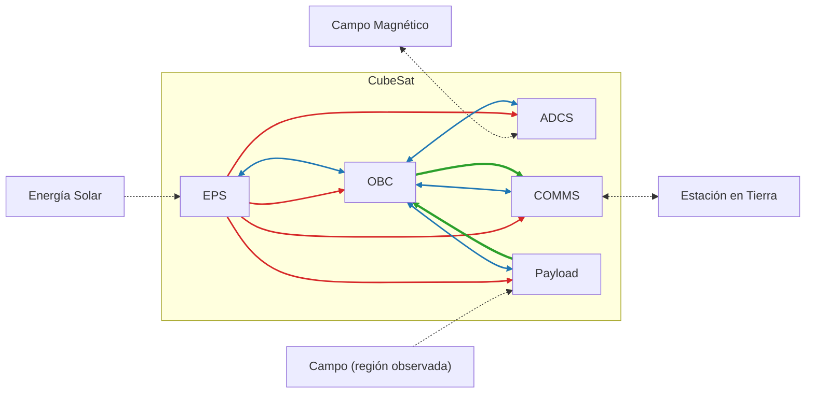

# CubeSat UD34

Diseño electrónico de un nanosatélite académico tipo CubeSat 1U cuya misión principal es la adquisición de imágenes multiespectrales de regiones productoras de café en Colombia y su transmisión a una estación terrestre de referencia en Medellín.

- **Autores:** Juan José Díaz, Kevin Echeverri
- **Institución:** Universidad de Antioquia
- **Curso:** Diseño de Productos Electrónicos
- **Documento fuente:** `Proyecto_Diseño_E1.pdf` (requisitos, especificaciones y arquitectura electrónica)

La información obtenida está orientada a análisis experimentales sobre la distribución y el estado relativo de la vegetación en lotes cafeteros. No pretende identificar plantas individuales, diagnosticar enfermedades ni generar recomendaciones agronómicas.

## Contenido

1. [Supuestos iniciales](#1-supuestos-iniciales)
2. [Requisitos](#2-requisitos)
3. [Diagrama de bloques](#3-diagrama-de-bloques)
4. [División de PCBs](#4-división-de-pcbs)
5. [Matriz de interfaces](#5-matriz-de-interfaces)
6. [Conexiones con periféricos](#6-conexiones-con-periféricos)

---

## 1. Supuestos iniciales

| ID | Supuesto |
|----|----------|
| S-01 | El satélite será un CubeSat de formato 1U. |
| S-02 | La vida útil nominal del CubeSat será de seis meses. |
| S-03 | Se considerará una órbita aproximadamente circular, heliosíncrona y a una altitud de 550 km. |
| S-04 | La estación terrestre de referencia estará ubicada en Medellín. |
| S-05 | La carga útil será una cámara multiespectral orientada al análisis experimental de regiones productoras de café. |
| S-06 | La energía será generada mediante paneles solares y almacenada en baterías recargables. |
| S-07 | El CubeSat contará con sensores y actuadores para determinar y modificar su orientación. |
| S-08 | Existirá comunicación bidireccional entre el CubeSat y la estación terrestre. |
| S-09 | El satélite no contará con un sistema de propulsión. |
| S-10 | El software de vuelo no será implementado durante el desarrollo del proyecto. |

---

## 2. Requisitos

Los requisitos se clasifican en funcionales (RF), no funcionales (RNF), ambientales (RA) y normativos (RN).

### 2.1 Criterios de prioridad

La prioridad no depende únicamente del origen del requisito, sino del efecto que tendría su incumplimiento sobre la misión y el desarrollo del sistema.

| Prioridad | Criterio |
|-----------|----------|
| Alta | El incumplimiento impide alcanzar un objetivo principal de la misión, compromete la operación o seguridad del CubeSat, o produce el incumplimiento de una restricción o norma obligatoria. |
| Media | El incumplimiento degrada el desempeño, limita alguna capacidad del sistema o reduce el margen operacional, pero no impide necesariamente alcanzar el objetivo principal de la misión. |
| Baja | El requisito representa una mejora deseable, facilita la integración, operación o desarrollo, pero su incumplimiento no compromete directamente el éxito mínimo de la misión. |

### 2.2 Matriz de requisitos

Todos los requisitos de la matriz preliminar tienen prioridad **Alta**. `TBD` indica un valor por determinar mediante análisis posteriores.

#### Requisitos funcionales

| ID | Requisito | Origen o justificación | Prioridad | Criterio de aceptación |
|----|-----------|------------------------|-----------|------------------------|
| RF-01 | El CubeSat deberá adquirir imágenes multiespectrales de la superficie terrestre durante el paso sobre las regiones de interés definidas para la misión. | S-05 / Objetivo de la misión | Alta | Se deberá verificar que la arquitectura de la carga útil permita adquirir y entregar al sistema de datos una imagen multiespectral. |
| RF-02 | El CubeSat deberá almacenar temporalmente los datos generados por la carga útil antes de su transmisión a tierra. | S-05 / Operación de la carga útil | Alta | La capacidad de almacenamiento definida deberá ser igual o superior al volumen máximo de datos generado entre oportunidades de descarga. |
| RF-03 | El CubeSat deberá transmitir a la estación terrestre los datos de misión y la telemetría correspondiente al estado del satélite. | S-08 / Comunicación satélite-tierra | Alta | El presupuesto de enlace deberá demostrar la capacidad de realizar el enlace descendente durante una ventana de comunicación prevista. |
| RF-04 | El CubeSat deberá recibir comandos provenientes de la estación terrestre. | S-08 / Comunicación bidireccional | Alta | La arquitectura de comunicaciones deberá contemplar un enlace ascendente capaz de recibir y entregar comandos al sistema de manejo de datos. |
| RF-05 | El CubeSat deberá determinar su orientación mediante información obtenida de sensores a bordo. | S-07 / Determinación de actitud | Alta | La arquitectura del sistema de determinación de actitud deberá disponer de información sensorial suficiente para estimar las variables de orientación requeridas por la misión. |
| RF-06 | El CubeSat deberá modificar su orientación mediante actuadores de control de actitud. | S-07 / Control de actitud | Alta | El análisis del sistema de control de actitud deberá demostrar que los actuadores seleccionados permiten realizar los cambios de orientación requeridos por la misión. |
| RF-07 | El CubeSat deberá generar energía eléctrica a partir de radiación solar durante los períodos de iluminación orbital. | S-06 / Generación de energía | Alta | El presupuesto de potencia deberá demostrar que la generación de energía satisface las necesidades establecidas para el perfil orbital considerado. |
| RF-08 | El CubeSat deberá almacenar energía eléctrica para alimentar sus subsistemas durante los períodos en los que la generación solar sea insuficiente. | S-06 / Almacenamiento de energía | Alta | El análisis energético deberá demostrar que la capacidad útil de almacenamiento permite cubrir el período crítico de operación, incluyendo los períodos de eclipse. |

#### Requisitos no funcionales

| ID | Requisito | Origen o justificación | Prioridad | Criterio de aceptación |
|----|-----------|------------------------|-----------|------------------------|
| RNF-01 | La plataforma espacial deberá ser capaz de operar nominalmente en órbita baja terrestre durante un período mínimo de seis (6) meses sin degradación crítica de sus funciones. | S-02 / Duración nominal de la misión | Alta | La selección y análisis de los subsistemas deberá demostrar compatibilidad con una duración mínima de misión de seis meses en el ambiente orbital considerado. |
| RNF-02 | El sistema eléctrico deberá mantener un balance energético no negativo para el ciclo orbital nominal de la misión. | S-06 / Continuidad operacional | Alta | El presupuesto energético de una órbita representativa deberá presentar una energía disponible igual o superior a la energía consumida, considerando las pérdidas definidas en el modelo. |
| RNF-03 | El sistema de comunicaciones deberá proporcionar un enlace con margen positivo bajo las condiciones nominales de comunicación con la estación terrestre de referencia. | S-04 y S-08 / Enlace de comunicaciones | Alta | El presupuesto de enlace deberá presentar un margen superior a 0 dB para las condiciones nominales adoptadas. |
| RNF-04 | Los subsistemas eléctricos deberán utilizar interfaces de alimentación y datos compatibles entre sí. | Integración del sistema | Alta | La matriz de interfaces deberá demostrar compatibilidad de tensión, corriente, niveles eléctricos y protocolos entre los elementos interconectados. |

#### Requisitos ambientales

| ID | Requisito | Origen o justificación | Prioridad | Criterio de aceptación |
|----|-----------|------------------------|-----------|------------------------|
| RA-01 | El hardware del CubeSat deberá ser compatible con la operación en vacío durante la fase orbital de la misión. | S-03 / Ambiente espacial de operación | Alta | Los componentes y materiales seleccionados deberán disponer de características documentadas compatibles con la operación en vacío o de una justificación técnica para su utilización. |
| RA-02 | El CubeSat deberá soportar el entorno térmico asociado con los ciclos de iluminación y eclipse de la órbita definida para la misión. | S-03 / Entorno térmico orbital | Alta | El análisis térmico deberá demostrar que las temperaturas estimadas de los componentes permanecen dentro de sus límites admisibles durante los casos orbitales considerados. |
| RA-03 | La estructura y los componentes del CubeSat deberán permanecer mecánicamente íntegros frente a las cargas previstas durante el lanzamiento y despliegue. | Entorno de lanzamiento / Seguridad | Alta | La verificación estructural deberá demostrar compatibilidad con las cargas y niveles de vibración adoptados para el diseño. |
| RA-04 | Los equipos electrónicos críticos del CubeSat deberán mantener su funcionalidad después de una Dosis Ionizante Total de diseño de al menos TBD krad(Si). | S-02 y S-03 / Entorno de radiación correspondiente a una misión de seis meses en SSO a 550 km | Alta | El valor de TID de diseño se determinará mediante un modelo de radiación orbital para una misión de seis meses a 550 km, considerando el blindaje equivalente adoptado y el margen de diseño correspondiente. La tolerancia documentada de los elementos críticos deberá ser igual o superior a dicho valor. |
| RA-05 | Los componentes electrónicos críticos susceptibles a latch-up deberán presentar un umbral de susceptibilidad a SEL por iones pesados igual o superior a 60 MeV·cm²/mg. | S-03 / ECSS-E-ST-10-12C, entorno de radiación y efectos de evento único | Alta | Verificar documentalmente que todos los componentes críticos susceptibles a SEL presenten LETth ≥ 60 MeV·cm²/mg. |

#### Requisitos normativos

| ID | Requisito | Origen o justificación | Prioridad | Criterio de aceptación |
|----|-----------|------------------------|-----------|------------------------|
| RN-01 | La configuración mecánica del satélite deberá ser compatible con el formato CubeSat 1U definido por la CubeSat Design Specification aplicable al proyecto. | S-01 / CubeSat Design Specification Rev. 14.1 | Alta | Las dimensiones, envolvente, masa e interfaces mecánicas del modelo deberán verificarse contra las especificaciones aplicables de la CubeSat Design Specification. |
| RN-02 | Todas las partes del CubeSat deberán permanecer unidas al satélite durante lanzamiento, eyección y operación. | CubeSat Design Specification Rev. 14.1 | Alta | El diseño mecánico deberá demostrar que los elementos del CubeSat permanecen asegurados durante las fases consideradas. |
| RN-03 | Los materiales empleados en el CubeSat deberán cumplir los criterios de desgasificación aplicables al ambiente espacial definidos para el diseño. | CubeSat Design Specification Rev. 14.1 | Alta | La lista de materiales deberá incluir evidencia documental de cumplimiento de los criterios de desgasificación adoptados o una justificación para las excepciones identificadas. |
| RN-04 | El subsistema de comunicaciones deberá operar dentro de bandas y condiciones de emisión compatibles con la reglamentación de espectro aplicable a la misión. | S-08 / Regulación de comunicaciones satelitales | Alta | La banda y los parámetros de transmisión seleccionados deberán contrastarse con la asignación y autorización regulatoria aplicable antes de establecer el diseño definitivo. |

---

## 3. Diagrama de bloques

La arquitectura electrónica se divide en cinco bloques funcionales dentro del formato 1U:

| Bloque | Función | Referencia de diseño |
|--------|---------|----------------------|
| **Carga útil (PL)** | Cámara multiespectral (2048 × 1088 píxeles, 15 bandas, 600 a 860 nm) | Procesamiento en SoC híbrido |
| **Gestión de potencia (EPS)** | Generación, almacenamiento y distribución de energía | Compatible con STARBUCK-NANO, buses de 3,3 V y 5 V con protección LCL |
| **Computador de a bordo (OBC)** | Procesamiento, manejo de datos y coordinación central | SoC híbrido tipo SmartFusion2 (ARM + FPGA) |
| **Determinación y control de actitud (ADCS)** | Sensores y actuadores de orientación | Tres magnetorques ortogonales, magnetómetro MM200, sensores solares SS200 y giroscopio MEMS |
| **Comunicaciones (COMMS)** | Enlace bidireccional de telemetría y descarga de imágenes | UHF (TRX-U, 9,6 kbps) y Banda S (PULSAR-HSTX-C, 2,2 a 2,3 GHz, hasta 8 Mbps) |



El OBC actúa como nodo central del sistema. Los flujos se distinguen por color:

| Color | Tipo de flujo | Descripción |
|-------|---------------|-------------|
| Rojo | Potencia | Parten del EPS hacia todos los bloques para su energización. |
| Azul | Control y telemetría | Conectan el OBC de forma bidireccional con el EPS, el ADCS, COMMS y la carga útil. |
| Verde | Datos de alta velocidad | Van de la cámara multiespectral al OBC para su procesamiento, y del OBC al módulo de comunicaciones para su descarga a la estación terrestre. |
| Punteado | Entorno externo | Energía solar, campo magnético terrestre, región observada y estación terrestre. |

---

## 4. División de PCBs

El hardware se reparte en **tres PCBs** apiladas longitudinalmente en el eje Z mediante conectores estandarizados tipo PC/104. Esta partición busca modularidad, aislamiento frente a interferencias electromagnéticas (EMI) y facilidad de pruebas (AIV).

```text
        Nadir (cara superior)
  ┌─────────────────────────────────┐
  │ PCB 3: Carga útil + ADCS        │
  ├─────────────────────────────────┤
  │ PCB 2: OBC + COMMS              │
  ├─────────────────────────────────┤
  │ PCB 1: EPS + baterías           │
  └─────────────────────────────────┘
        Base del satélite
```

| PCB | Subsistemas | Ubicación | Contenido y justificación |
|-----|-------------|-----------|---------------------------|
| **PCB 1** | EPS (sistema de potencia) | Base del satélite | Aísla el ruido de conmutación de los convertidores DC/DC de los demás subsistemas. Integra el empaquetado de baterías, los reguladores MPPT y las interfaces hacia los interruptores de despliegue (kill-switches). |
| **PCB 2** | OBC + COMMS (cómputo central y comunicaciones) | Intermedia | Tarjeta de alta densidad. Alberga el SoC principal (SmartFusion2), las memorias asociadas y los módulos de radiofrecuencia (UHF y Banda S), apantallados para evitar acoplamientos con la lógica digital. |
| **PCB 3** | PL + ADCS (carga útil y actitud) | Cara superior, apuntando al Nadir | Aloja el sensor de la cámara multiespectral, los sensores de orientación inercial y magnética (alejados del ruido de corrientes del EPS) y la etapa de potencia de control (drivers PWM) para los magnetorques. |

**Notas de diseño**

- El apilado de 3 PCBs ocupa aproximadamente 34,8 mm en el eje Z, lo que deja unos 55 mm para las baterías y el lente de la cámara.
- La fijación rígida del apilamiento usa 4 separadores pasantes de aluminio.
- Las líneas críticas de potencia (3,3 V, 5 V y GND) duplican pines en el bus del sistema.
- En la matriz de decisión ponderada, la alternativa de 3 PCBs (modularidad) obtuvo 4,45 frente a 3,30 de la alternativa de 2 PCBs (alta integración).

---

## 5. Matriz de interfaces

Interconexiones eléctricas transversales a través del bus de apilamiento PC/104 y de las líneas dedicadas que enlazan las 3 PCBs.

| ID | Origen | Destino | Función | Señal o protocolo | Características eléctricas preliminares | Tasa o volumen de datos | Observaciones |
|----|--------|---------|---------|-------------------|------------------------------------------|-------------------------|---------------|
| IF-01 | PCB 1 (EPS) | PCB 2 (OBC) | Telemetría del sistema de potencia y comandos de carga | Bus CAN | Diferencial, niveles lógicos de 3,3 V (CAN transceiver) | 500 kbps (nominal) | Ocupa solo 2 pines en el bus de apilamiento vertical. |
| IF-02 | PCB 3 (PL) | PCB 2 (OBC) | Transmisión de imágenes multiespectrales capturadas | Sub-LVDS / MIPI CSI-2 | Diferencial de baja tensión, pares enrutados con impedancia controlada (100 Ω) | ≈ 7,37 MB por frame capturado | Enlace de alta velocidad directo a los pines de la FPGA para evitar cuellos de botella. |
| IF-03 | PCB 2 (OBC) | Memoria (PCB 2) | Almacenamiento masivo temporal de imágenes | SPI Quad / Octal | Single-ended, niveles lógicos CMOS de 3,3 V | > 100 Mbps | Conexión local dentro de la misma placa para minimizar interferencias EMI. |
| IF-04 | PCB 3 (ADCS) | PCB 2 (OBC) | Lectura de vectores del magnetómetro y sensores solares | I²C / SPI | Single-ended, bus compartido con resistencias pull-up, 3,3 V | 400 kbps (I²C Fast Mode) | Los sensores se ubican en la placa superior para alejarlos de las corrientes del EPS. |
| IF-05 | PCB 2 (OBC) | PCB 3 (ADCS) | Señales de control hacia los actuadores magnéticos | PWM (digital) | Señales digitales de 3,3 V dirigidas a las compuertas de los puentes H | 10 kHz a 50 kHz (frecuencia de conmutación) | Modulación generada por los temporizadores del ARM Cortex. |
| IF-06 | PCB 2 (OBC) | COMMS (UHF) | Transmisión de paquetes de estado (housekeeping) y comandos | UART / SPI | Single-ended, UART a 3,3 V | 9,6 kbps | Interfaz crítica y de ultra bajo consumo hacia el transceptor TRX-U. |
| IF-07 | PCB 2 (OBC) | COMMS (Banda S) | Descarga de carga útil hacia la estación terrestre | LVDS | Diferencial de baja tensión (100 Ω de impedancia característica) | 1 Mbps a 8 Mbps | El transmisor de Banda S se enciende únicamente durante el pase sobre Medellín. |

---

## 6. Conexiones con periféricos

Interacción directa de los subsistemas internos con el entorno físico, las antenas y las caras estructurales de la plataforma 1U.

| Periférico / módulo | Subsistema | Tipo de conexión | Función y descripción |
|---------------------|------------|------------------|-----------------------|
| Paneles solares (caras X, Y, Z) | EPS (PCB 1) | Potencia (DC) | Arneses de cableado directo desde las caras estructurales hacia los reguladores MPPT en la tarjeta de potencia. |
| Pack de baterías | EPS (PCB 1) | Potencia y térmica | Conexión de potencia bidireccional y lectura del termistor interno para monitoreo y protección contra temperaturas extremas en vacío. |
| Sensor óptico (lente) | Carga útil (PCB 3) | Óptico-mecánica | Integración del tren óptico acoplado físicamente sobre el sensor multiespectral en la PCB 3, alineado con la ventana del chasis. |
| Magnetorques triaxiales | ADCS (PCB 3) | Potencia de control | Cables enrutados desde los puentes H en la tarjeta superior hacia las bobinas con núcleo magnético montadas en la estructura. |
| Antena UHF desplegable | COMMS (PCB 2) | Radiofrecuencia | Cable coaxial micro-RF (U.FL a SMA) de 50 Ω hacia el mecanismo de despliegue en la cara de radiación UHF. |
| Antena Banda S (parche) | COMMS (PCB 2) | Radiofrecuencia | Línea coaxial rígida de baja pérdida en 2,4 GHz hacia el arreglo de parche direccional en la cara externa de transmisión. |
| Microinterruptores (kill-switches) | EPS (PCB 1) | Señal discreta | Conectores dedicados para los switches mecánicos de los rieles que aíslan la batería mientras el satélite permanece en el P-POD. |
